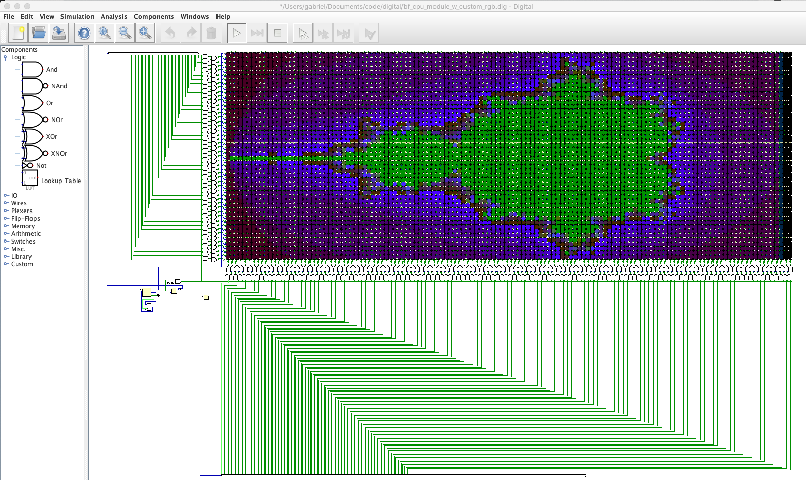
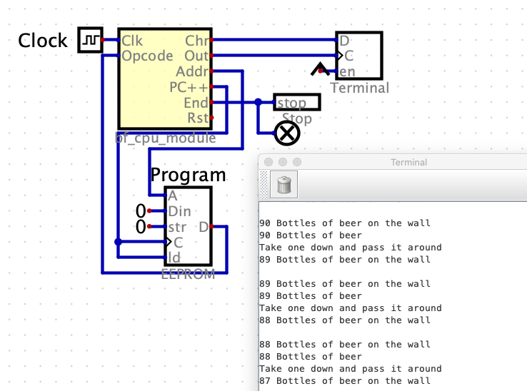
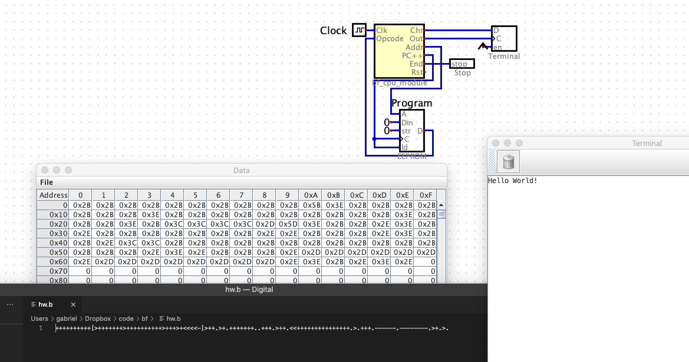
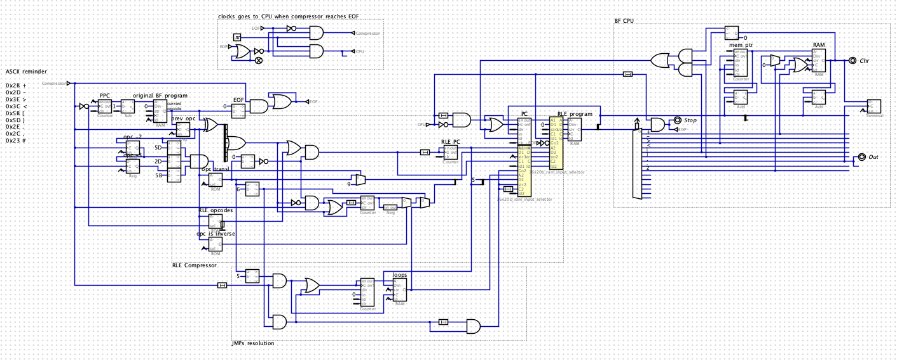

Collection of circuits for [Digital](https://github.com/hneemann/Digital) for learning purpose

The goal was mostly to build a brainfuck CPU from the ground up, memory, display, counter and all. But performance limitations do not allow for the millions gates required.
Instead, the current BF CPU uses built-in parts, including the console output.

The custom RGB display was designed to show the output of mandelbrot.b (132 columns, 49 rows).

The brainfuck CPU features a preprocessor that performs transformations on the code in order to simplify (and speed up) the execution. In a single pass, it

- RLE compresses `+-><` instructions ;
- transforms `-` and `<` instructions into `+` and `>` respectively, with a negative operand
- transforms `[` and `]` into conditional JMPs

### Might be of interest
- bf_cpu_module_w_console.dig
- bf_cpu_module_w_custom_rgb.dig

Remember to set the BF program in Digital > Edit > Circuit specific settings > Advanced > Program file

### How to use:
- Download [Digital](https://github.com/hneemann/Digital/releases)
- Clone this repository
- In Digital, you might need to set `Edit > Settings > Advanced > Library` to the path of your clone of this repo.
- Open `bf_cpu_module_w_console.dig``
- Run

